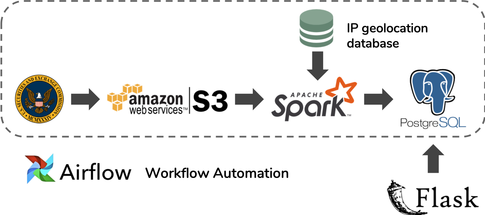

# Wise Log
Surfacing investment opportunities

<!-- TOC -->

- [Wise Log](#wise-log)
    - [1. PROJECT ARTIFACTS](#1-project-artifacts)
    - [2. INTRODUCTION](#2-introduction)
    - [3. DATASETS](#3-datasets)
    - [4. ARCHITECTURE](#4-architecture)
        - [4.1 Environment Setup](#41-environment-setup)
        - [4.2 Data Ingestion](#42-data-ingestion)
        - [4.3 Batch Processing](#43-batch-processing)
        - [4.4 User Interface](#44-user-interface)
    - [5. ENGINEERING CHALLENGES](#5-engineering-challenges)

<!-- /TOC -->


## 1. PROJECT ARTIFACTS 
* [Demostration URL](wiselog.club)
* [Presentation Slide](bit.ly/wiselog_demo)
* Demostration vedio
  
## 2. INTRODUCTION
In different development stages, companies always want to attract more investors for investment due to different reaseons, such as getting start a new service, expanding market and exploring new collaboration, etc. It is necessary to identify the areas with more investors who are interested in our companies. However, the information of potential investors are not intuitive for companies.      

To provide that part of information to companies, WiseLog is a platform for companies seeking potential investment and bussiness opportunities. The data is the users' access statistics of logs for companies' filings from SEC.gov. By  analyzing and aggregation for companies in different countries and cities, users can query for the aggregation results for one specific company during a time period on the website.

## 3. DATASETS
* [EDGAR Log File Data Set](https://www.sec.gov/dera/data/edgar-log-file-data-set.html)     
  EDGAR, the Electronic Data Gathering, Analysis, and Retrieval system, performs automated collection, validation, indexing, acceptance, and forwarding of submissions by companies and others who are required by law to file forms with the U.S. Securities and Exchange Commission (SEC). In 1984, EDGAR began collecting electronic documents to help investors get information.
  
  The EDGAR Log File Data Set contains information in CSV format extracted from Apache log files that record and store user access statistics for the SEC.gov website. The dataset provides information on website traffic for EDGAR filings, which records the log of users’ IP address, requests of company’s documents on the SEC website, covering the period from February 14, 2003 to June 30, 2017.          

  With the EDGAR logs, we are able to gain insights of when and how many people requested for specific companies' financial documents as a reference of their investment opportunities on stock market in different areas. However, only the data from January 1, 2016 to December 31, 2016 will be used (around 3GB per day, ~1TB in total) in this project.
* [CIK File](https://www.sec.gov/Archives/edgar/cik-lookup-data.txt)    
  The Central Index Key (CIK) is used on the SEC's computer systems to identify corporations and individual people who have filed disclosure with the SEC. This data provide company's name of each CIK number.
## 4. ARCHITECTURE

### 4.1 Environment Setup
 For environment configuration and tools setup, please refer to [SETUP.md](./SETUP.md).
### 4.2 Data Ingestion
* Amazon AWS S3      
  AWS S3 is a way for long term storage. The data file was first downloaded and uncompressed to an EC2 instance. Since the every single uncompressed file is almost 3GB, I then gzipped it and stored it in AWS S3 bucket, which compressed into only ~170GB in total and then removed all files in EC2 instance. 
### 4.3 Batch Processing
* Apache Spark      
  Apache Spark is a fast and general-purpose cluster computing system. In this project, Spark was used to process batch of historical log data. IP geolocation database ([GeoLite2-City.mmdb](https://geolite.maxmind.com/download/geoip/database/GeoLite2-City.tar.gz)) was integrated in spark job to transform the ip address to geoname_id (A unique identifier for the network's location (country and city respectively) as specified by [GeoNames](https://www.geonames.org/).)      
  After transformation, the aggregation count for each company in different city were stored in PostgresSQL.
* PostgresSQL       
  To reduce the number of data in database, the results of log processing only include identifier for each company and each city (country), which is used for groupBy operation. While detailed information of companies and cities are stored in other two separate tables. Three tables are stored in PostgresSQL:    
     
  * log_geo_location table:     
    Store aggregation results for company of each city in one day.
    ```postgresql
    log_geo_location:
      -- date         TEXT
      -- geoname_id   TEXT
      -- cik          TEXT
      -- country_code TEXT
      -- count        BIGINT
    ```
  * cik_company table:      
    Store the cik identifier and name of each company registered on SEC.gov.
    ```postgresql
    cik_company:
      -- cik    TEXT
      -- name   TEXT
    ```
  * geo_coordinate table:       
    Store the id, country, state, city and center coordinate information of each city.
    ```postgresql
    geo_coordinate:
      -- geoname_id         TEXT
      -- country_code       TEXT
      -- country_name       TEXT
      -- subdivision_name   TEXT
      -- city_name          TEXT
      -- lat                DOUBLE
      -- lng                DOUBLE
    ```
* Airflow       
  Scheduling and monitoring workflow of downloading data to s3 and spark batch processing.
### 4.4 User Interface
* Flask     
  Front-end application to get user access insights of companies in different areas during a time period. Connection between pipeline users and the PostgreSQL database.
## 5. ENGINEERING CHALLENGES